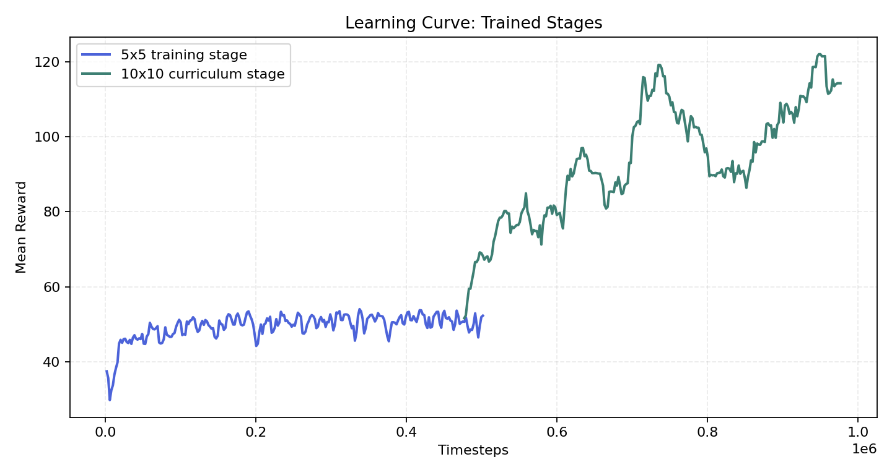
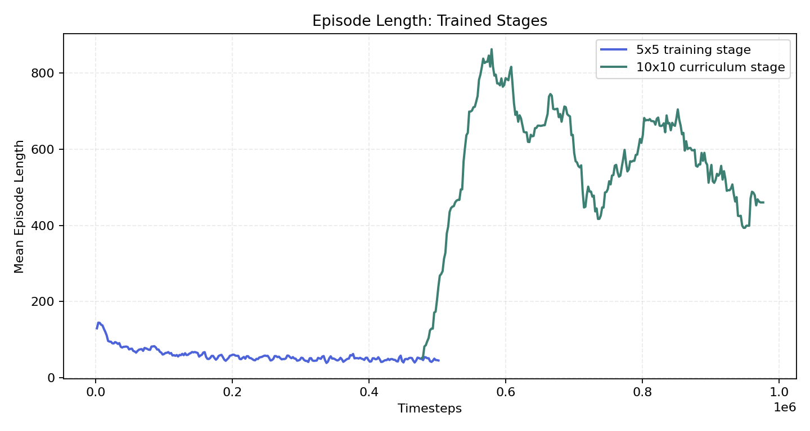
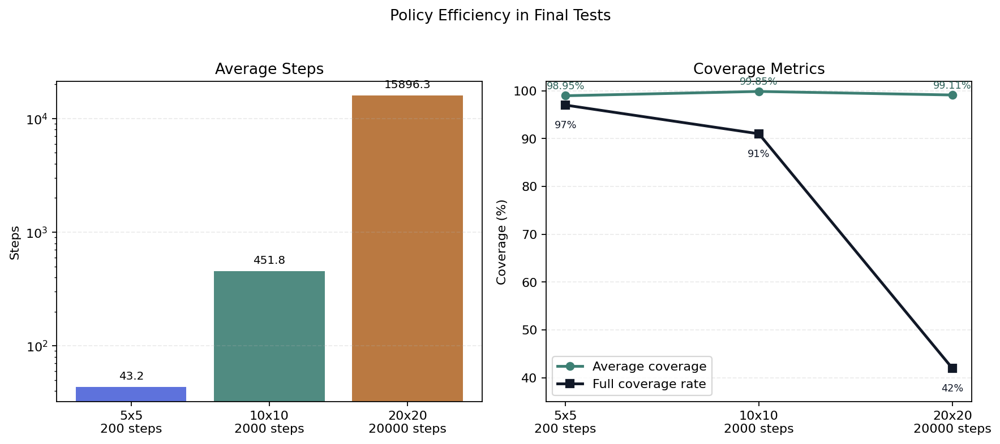
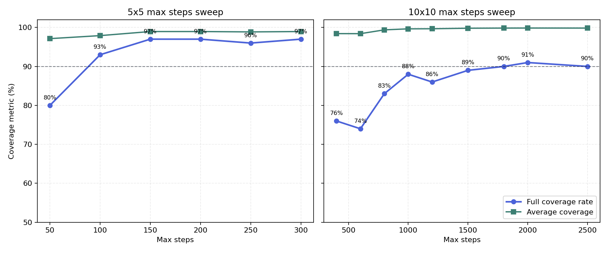
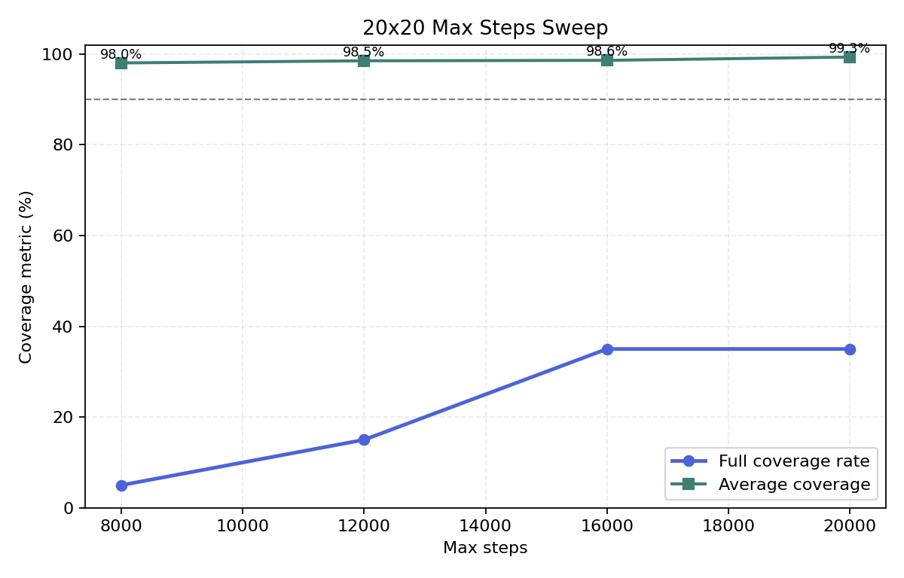

# Relatório APS - Coverage Path Planning com PPO

## Objetivo

O objetivo deste trabalho foi melhorar o desempenho do agente no ambiente de
Coverage Path Planning do repositório `gym_custom_env`, mantendo a observação
parcial do ambiente. O agente toma decisões a partir da posição normalizada, do
progresso da cobertura e da matriz local `5x5` ao redor da posição atual.

Os experimentos foram realizados nos ambientes `5x5` com 3 obstáculos, `10x10`
com 12 obstáculos e `20x20` com 48 obstáculos.

## Estratégia escolhida

A estratégia escolhida foi treinar o agente com `MaskablePPO`, uma variação do
PPO que permite mascarar ações inválidas. A máscara usada neste trabalho é
local: ela remove apenas ações que levariam o agente a bater em parede ou em
obstáculo visível na matriz `5x5`.

Essa máscara não fornece o mapa completo ao agente. Ela usa somente a informação
que já aparece na observação parcial do ambiente:

- direita: célula `(2, 3)` da matriz `5x5`;
- cima: célula `(1, 2)`;
- esquerda: célula `(2, 1)`;
- baixo: célula `(3, 2)`.

Além disso, foi usado curriculum learning. Primeiro, o agente foi treinado no
ambiente `5x5`. Depois, o modelo treinado foi carregado como ponto de partida
para continuar o treinamento no ambiente `10x10`. Para o ambiente `20x20`, foi
avaliada a transferência da política treinada no `10x10`, mantendo a mesma
representação local e sem fornecer o mapa completo ao agente.

## Justificativa

O problema é parcialmente observável. A matriz `5x5` informa apenas uma vizinhança
local do agente, então situações localmente parecidas podem exigir ações
diferentes dependendo do histórico de exploração. Isso torna o problema mais
difícil do que um GridWorld com mapa completo.

O action masking ajuda porque evita ações que são claramente ruins no estado
atual, como tentar atravessar uma parede ou um obstáculo já visível. Com isso, o
algoritmo gasta menos amostras aprendendo que essas ações são ruins e consegue
concentrar o treinamento nas decisões realmente relevantes: escolher entre
células livres, revisitar regiões quando necessário e continuar a exploração.

O curriculum learning foi escolhido porque a política aprendida no `5x5` já
captura comportamentos básicos de cobertura. Ao continuar o treinamento no
`10x10`, o agente adapta essa política a episódios mais longos e a uma quantidade
maior de obstáculos.

## Implementação

As alterações principais foram feitas nos arquivos `grid_world_cpp.py` e
`train_grid_world_cpp.py`:

- uso de uma janela local `5x5`, mantendo o agente no centro da observação;
- ajuste da função de reward para incentivar novas células, penalizar colisões e
  dar maior bônus à cobertura completa;
- inclusão do algoritmo `MaskablePPO` da biblioteca `sb3-contrib`;
- criação de uma máscara de ações baseada apenas na matriz local `5x5`;
- suporte a hiperparâmetros via linha de comando;
- suporte a curriculum learning por meio do argumento `--model`;
- avaliação periódica durante o treinamento, salvando o melhor checkpoint;
- remoção da pasta `data/` do `.gitignore`, para que os modelos treinados sejam
  incluídos no repositório.

Também foi criado o script `analyze_cpp_map_connectivity.py`, usado apenas para
analisar os mapas gerados pelo ambiente. Esse script não altera o ambiente nem é
usado pela política do agente.

## Como reproduzir

Instale as dependências:

```bash
pip install -r requirements.txt
```

Treine o agente no ambiente `5x5` com representação local `5x5`. O treinamento
salva o modelo final em `data/` e o melhor checkpoint em
`log/<RUN_5X5>/best_model/best_model.zip`:

```bash
python train_grid_world_cpp.py train 5 3 200 500000 --algo maskable --obs-window-size 5 --learning-rate 0.0005 --ent-coef 0.01 --eval-freq 25000
```

Teste o melhor modelo no `5x5`:

```bash
python train_grid_world_cpp.py test 5 3 200 --model data/maskable_cpp_obs5_5x5_best.zip --algo maskable --obs-window-size 5 --episodes 100 --stochastic
```

Use o melhor modelo `5x5` como ponto de partida para o curriculum no `10x10`:

```bash
python train_grid_world_cpp.py curriculum 10 12 2500 500000 --algo maskable --obs-window-size 5 --model data/maskable_cpp_obs5_5x5_best.zip --learning-rate 0.00005 --ent-coef 0.01 --eval-freq 50000
```

Teste o melhor modelo obtido no `10x10`:

```bash
python train_grid_world_cpp.py test 10 12 400 --model data/maskable_cpp_obs5_10x10_best.zip --algo maskable --obs-window-size 5 --episodes 100 --stochastic
```

O experimento final no `10x10` usa um limite maior de passos para avaliar a
estabilização da política no ambiente maior:

```bash
python train_grid_world_cpp.py test 10 12 2000 --model data/maskable_cpp_obs5_10x10_best.zip --algo maskable --obs-window-size 5 --episodes 100 --stochastic
```

Para reproduzir a análise de conectividade dos mapas:

```bash
python analyze_cpp_map_connectivity.py 5 3 200 1000
python analyze_cpp_map_connectivity.py 10 12 400 1000
```

Para avaliar o ambiente `20x20`:

```bash
python train_grid_world_cpp.py test 20 48 20000 --model data/maskable_cpp_obs5_20x20_best.zip --algo maskable --obs-window-size 5 --episodes 100 --stochastic
```

## Hiperparâmetros

| Etapa | Ambiente | Timesteps | Learning rate | Entropy coef. | Gamma |
| --- | ---: | ---: | ---: | ---: | ---: |
| Treino inicial | 5x5 | 500.000 | 0.0005 | 0.01 | 0.995 |
| Curriculum | 10x10 | 500.000 | 0.00005 | 0.01 | 0.995 |

No `20x20`, foi avaliada a política obtida no `10x10` por transferência direta
para o ambiente maior.

Outros parâmetros usados no `MaskablePPO`:

| Parâmetro | Valor |
| --- | ---: |
| `n_steps` | 256 |
| `batch_size` | 256 |
| `n_epochs` | 6 |
| `gae_lambda` | 0.95 |
| `clip_range` | 0.2 |
| `n_envs` | 8 |

Nos testes, as ações foram amostradas de forma estocástica. Essa escolha reduziu
ciclos locais observados com ações determinísticas.

## Resultados

Cada configuração foi avaliada em 100 episódios.

| Ambiente | Obstáculos | Max steps | Full Coverage Rate | Cobertura média | Desvio da cobertura | Pior cobertura | Passos médios |
| --- | ---: | ---: | ---: | ---: | ---: | ---: | ---: |
| 5x5 | 3 | 200 | 97/100 | 98.95% | 9.51% | 4.55% | 43.2 |
| 10x10 | 12 | 400 | 76/100 | 98.42% | 6.03% | 52.27% | 263.6 |
| 10x10 | 12 | 2000 | 91/100 | 99.85% | 0.64% | 94.32% | 451.8 |
| 20x20 | 48 | 20000 | 42/100 | 99.11% | 1.32% | 94.03% | 15896.3 |

Os gráficos abaixo resumem a comparação do full coverage rate e a cobertura
média obtida nos experimentos finais.

<p align="center">
  
</p>

<p align="center">
  
</p>

As curvas abaixo mostram a evolução dos estágios efetivamente treinados da
solução final (`5x5` e curriculum no `10x10`). A avaliação no `20x20` foi feita
por transferência da política obtida no `10x10` e aparece nos gráficos de
resultados finais e na análise de `max_steps`. O treinamento foi levado até
`500.000` timesteps em cada etapa principal para observar a estabilização. A
recompensa média indica a melhora da política ao longo do treino. O tamanho
médio dos episódios ajuda a interpretar a eficiência: quando o agente aprende a
cobrir mais células sem ficar preso por muito tempo, a duração média tende a
diminuir ou se estabilizar em valores menores.

<p align="center">
  
</p>

<p align="center">
  
</p>

Por fim, o gráfico de eficiência final compara os passos médios dos testes com o
full coverage rate obtido em cada configuração.

<p align="center">
  
</p>

O caso `10x10` com `max_steps=400` segue a configuração principal discutida para
ambientes maiores. Como vários episódios no `10x10` terminavam com cobertura
muito próxima de `100%`, mas atingiam o limite de passos antes de visitar a
última região, foi feita uma análise variando `max_steps` nos dois ambientes.

<p align="center">
  
</p>

No `5x5`, o full coverage rate estabilizou a partir de aproximadamente `150` a
`200` passos. No `10x10`, o resultado continuou melhorando com limites maiores e
atingiu `91/100` com `max_steps=2000`. O número médio de passos nesse caso foi
`451.8`, abaixo do limite máximo, o que indica que o limite maior serve
principalmente para reduzir truncamentos nos episódios mais difíceis.

Também foi feita uma análise no ambiente `20x20`. Nesse caso, o objetivo
principal foi verificar a cobertura média, pois os episódios chegam muito perto
de `100%` mas frequentemente demoram para encontrar a última célula livre.

<p align="center">
  
</p>

Com `max_steps=20000`, a avaliação final em 100 episódios obteve cobertura média
de `99.11%`, pior cobertura de `94.03%` e full coverage rate de `42/100`. Esse
resultado mostra que a política cobre praticamente todo o mapa no ambiente maior,
mantendo observação parcial `5x5`.

## Comparação com o PPO inicial

O enunciado apresenta resultados de referência para o agente PPO original:

| Ambiente | Full Coverage Rate citado |
| --- | ---: |
| 5x5 | entre 69/100 e 81/100 |
| 10x10 | entre 59/100 e 70/100 |

No `5x5`, o agente com `MaskablePPO` e observação local `5x5` alcançou `97/100`,
acima dos resultados de referência. No `10x10`, o resultado principal foi
`76/100` com cobertura média de `98.42%`. Com `max_steps=2000`, o full coverage
subiu para `91/100` e a cobertura média para `99.85%`.

No `20x20`, a cobertura média foi `99.11%` em 100 episódios. Esse resultado
mantém cobertura próxima de `100%` em um ambiente maior, ainda com observação
parcial `5x5`.

## Análise dos resultados

O desempenho no `5x5` ficou próximo de cobertura total. A máscara local reduziu
ações inválidas e tornou o aprendizado mais eficiente. A janela `5x5` deu ao
agente um pouco mais de contexto local sem fornecer o mapa completo.

No `10x10` e no `20x20`, a cobertura média também ficou alta, mas o full coverage
rate foi mais instável. Em muitos episódios que não terminaram com cobertura
completa, o agente chegou a cobrir mais de `99%` das células livres. Isso indica
que a política aprendeu um comportamento de exploração eficiente, mas ainda pode
ficar presa em ciclos locais ou demorar para encontrar a última célula não
visitada.

O aumento de `max_steps` de 400 para 2000 melhorou o resultado no `10x10`,
passando de `76/100` para `91/100`. Isso sugere que parte dos episódios não
falha por falta de capacidade de cobertura, mas por limite de passos em um
ambiente maior.

## Análise do gerador de mapas

Foi feita uma análise complementar do gerador de obstáculos do ambiente original.
Foram gerados 1000 mapas para cada configuração e calculada a fração de células
livres alcançáveis a partir da posição inicial do agente.

| Ambiente | Mapas desconectados | Fração média alcançável | Menor fração alcançável |
| --- | ---: | ---: | ---: |
| 5x5, 3 obstáculos | 51/1000 | 0.9947 | 0.0455 |
| 10x10, 12 obstáculos | 104/1000 | 0.9973 | 0.0114 |
| 20x20, 48 obstáculos | 227/1000 | 0.9989 | 0.9744 |

Essa análise mostra que o ambiente pode gerar mapas em que parte das células
livres não é alcançável a partir da posição inicial. Nesses episódios, cobertura
de `100%` não depende apenas da política aprendida. Os testes da seção de
resultados não foram filtrados por conectividade; a análise foi usada apenas
para interpretar a métrica de full coverage. No `20x20`, esse efeito ajuda a
explicar por que a cobertura média fica muito próxima de `100%`, mesmo quando o
full coverage rate não acompanha na mesma proporção.

## Discussão final

Nos ambientes maiores, como o agente observa apenas uma janela `5x5`, ele precisa
inferir a estratégia de cobertura a partir de informação local. Isso pode gerar
ciclos locais ou trajetórias longas quando falta pouca cobertura para completar o
episódio, especialmente no `20x20`.

Melhorias possíveis mantendo a observação parcial:

- treinar uma política recorrente por mais tempo;
- usar curriculum com tamanhos intermediários, como `7x7` e `15x15`, antes dos
  ambientes maiores;
- testar diferentes valores de `ent_coef` para equilibrar exploração e
  estabilidade;
- avaliar resultados por múltiplas seeds;
- comparar separadamente mapas conectados e desconectados, sem alterar o treino
  do agente.

## Conclusão

A estratégia com `MaskablePPO`, máscara local de ações e curriculum learning
melhorou o desempenho em relação ao PPO original apresentado como referência.
O agente manteve a observação parcial `5x5` e não recebeu acesso ao mapa
completo. O resultado foi próximo de cobertura total no `5x5`, atingiu full
coverage acima de `90/100` no `10x10` com limite de passos maior e manteve
cobertura média próxima de `100%` no `20x20`.
