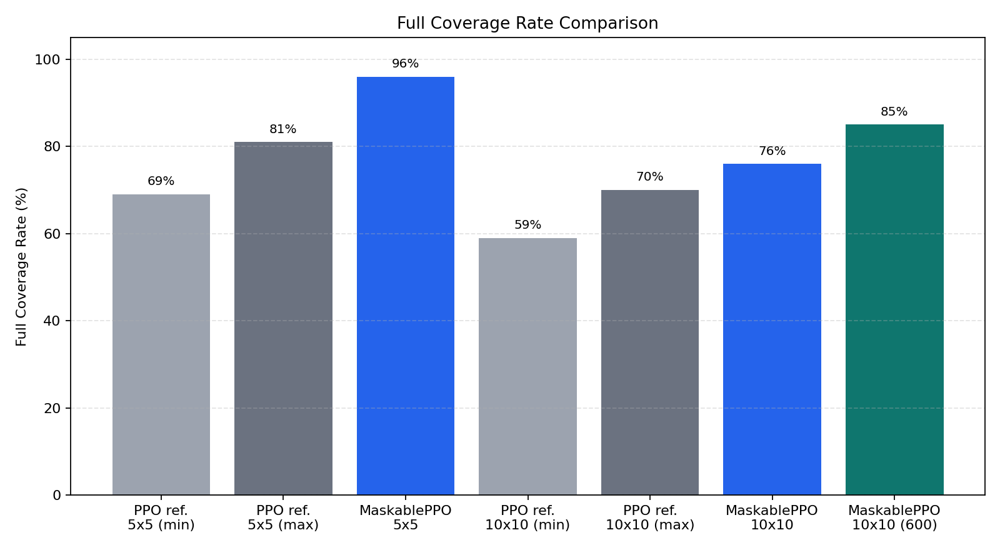
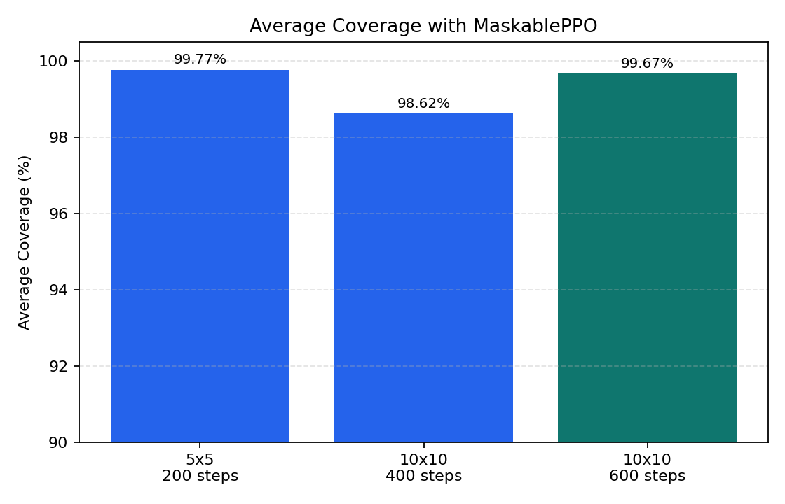

# Relatório APS - Coverage Path Planning com PPO

## Objetivo

O objetivo deste trabalho foi melhorar o desempenho do agente no ambiente de
Coverage Path Planning do repositório `gym_custom_env`, mantendo a observação
parcial do ambiente. O agente toma decisões a partir da posição normalizada, do
progresso da cobertura e da matriz local `3x3` ao redor da posição atual.

Os experimentos foram realizados nos ambientes `5x5` com 3 obstáculos e `10x10`
com 12 obstáculos.

## Estratégia escolhida

A estratégia escolhida foi treinar o agente com `MaskablePPO`, uma variação do
PPO que permite mascarar ações inválidas. A máscara usada neste trabalho é
local: ela remove apenas ações que levariam o agente a bater em parede ou em
obstáculo visível na matriz `3x3`.

Essa máscara não fornece o mapa completo ao agente. Ela usa somente a informação
que já aparece na observação parcial do ambiente:

- direita: célula `(1, 2)` da matriz `3x3`;
- cima: célula `(0, 1)`;
- esquerda: célula `(1, 0)`;
- baixo: célula `(2, 1)`.

Além disso, foi usado curriculum learning. Primeiro, o agente foi treinado no
ambiente `5x5`. Depois, o modelo treinado foi carregado como ponto de partida
para continuar o treinamento no ambiente `10x10`.

## Justificativa

O problema é parcialmente observável. A matriz `3x3` informa apenas a vizinhança
imediata do agente, então situações localmente parecidas podem exigir ações
diferentes dependendo do histórico de exploração. Isso torna o problema mais
difícil do que um GridWorld com mapa completo.

O action masking ajuda porque evita ações que são claramente ruins no estado
atual, como tentar atravessar uma parede ou um obstáculo já visível. Com isso, o
algoritmo gasta menos amostras aprendendo que essas ações são ruins e consegue
concentrar o treinamento nas decisões realmente relevantes: escolher entre
células livres, revisitar regiões quando necessário e continuar a exploração.

O curriculum learning foi escolhido porque a política aprendida no `5x5` já
captura comportamentos básicos de cobertura. Ao continuar o treinamento no
`10x10`, o agente adapta essa política a episódios mais longos e a uma quantidade
maior de obstáculos.

## Implementação

As alterações principais foram feitas no arquivo `train_grid_world_cpp.py`:

- inclusão do algoritmo `MaskablePPO` da biblioteca `sb3-contrib`;
- criação de uma máscara de ações baseada apenas na matriz local `3x3`;
- suporte a hiperparâmetros via linha de comando;
- suporte a curriculum learning por meio do argumento `--model`;
- avaliação periódica durante o treinamento, salvando o melhor checkpoint.

Também foi criado o script `analyze_cpp_map_connectivity.py`, usado apenas para
analisar os mapas gerados pelo ambiente. Esse script não altera o ambiente nem é
usado pela política do agente.

## Como reproduzir

Instale as dependências:

```bash
pip install -r requirements.txt
```

Treine o agente no ambiente `5x5`:

```bash
python train_grid_world_cpp.py train 5 3 200 100000 --algo maskable --learning-rate 0.0005 --ent-coef 0.01 --eval-freq 25000
```

O treinamento salva o modelo final em `data/` e o melhor checkpoint em
`log/<RUN_5X5>/best_model/best_model.zip`. Use o melhor checkpoint para o
refinamento no `5x5`:

```bash
python train_grid_world_cpp.py curriculum 5 3 200 300000 --algo maskable --model log/<RUN_5X5>/best_model/best_model.zip --learning-rate 0.0001 --ent-coef 0.01 --eval-freq 25000
```

Teste o melhor modelo refinado no `5x5`:

```bash
python train_grid_world_cpp.py test 5 3 --model log/<RUN_5X5_REFINADO>/best_model/best_model.zip --algo maskable --episodes 100 --stochastic
```

Use o melhor modelo refinado como ponto de partida para o curriculum no `10x10`:

```bash
python train_grid_world_cpp.py curriculum 10 12 400 500000 --algo maskable --model log/<RUN_5X5_REFINADO>/best_model/best_model.zip --learning-rate 0.00005 --ent-coef 0.01 --eval-freq 50000
```

Teste o melhor modelo obtido no `10x10`:

```bash
python train_grid_world_cpp.py test 10 12 400 --model log/<RUN_10X10>/best_model/best_model.zip --algo maskable --episodes 100 --stochastic
```

O experimento adicional com `max_steps=600` usa o mesmo modelo `10x10`:

```bash
python train_grid_world_cpp.py test 10 12 600 --model log/<RUN_10X10>/best_model/best_model.zip --algo maskable --episodes 100 --stochastic
```

Para reproduzir a análise de conectividade dos mapas:

```bash
python analyze_cpp_map_connectivity.py 5 3 200 1000
python analyze_cpp_map_connectivity.py 10 12 400 1000
```

## Hiperparâmetros

| Etapa | Ambiente | Timesteps | Learning rate | Entropy coef. | Gamma |
| --- | ---: | ---: | ---: | ---: | ---: |
| Treino inicial | 5x5 | 100.000 | 0.0005 | 0.01 | 0.995 |
| Refinamento | 5x5 | 300.000 | 0.0001 | 0.01 | 0.995 |
| Curriculum | 10x10 | 500.000 | 0.00005 | 0.01 | 0.995 |

Outros parâmetros usados no `MaskablePPO`:

| Parâmetro | Valor |
| --- | ---: |
| `n_steps` | 256 |
| `batch_size` | 256 |
| `n_epochs` | 6 |
| `gae_lambda` | 0.95 |
| `clip_range` | 0.2 |
| `n_envs` | 8 |

Nos testes, as ações foram amostradas de forma estocástica. Essa escolha reduziu
ciclos locais observados com ações determinísticas.

## Resultados

Cada configuração foi avaliada em 100 episódios.

| Ambiente | Obstáculos | Max steps | Full Coverage Rate | Cobertura média | Desvio da cobertura | Pior cobertura | Passos médios |
| --- | ---: | ---: | ---: | ---: | ---: | ---: | ---: |
| 5x5 | 3 | 200 | 96/100 | 99.77% | 1.18% | 90.91% | 50.1 |
| 10x10 | 12 | 400 | 76/100 | 98.62% | 6.11% | 47.73% | 274.3 |
| 10x10 | 12 | 600 | 85/100 | 99.67% | 0.98% | 94.32% | 322.3 |

Os gráficos abaixo resumem a comparação do full coverage rate e a cobertura
média obtida nos experimentos finais.





O caso `10x10` com `max_steps=400` segue a configuração principal discutida para
ambientes maiores. O caso com `max_steps=600` foi usado como experimento de
hiperparâmetro, porque vários episódios no `10x10` terminavam com cobertura
muito próxima de `100%`, mas atingiam o limite de passos antes de visitar a
última região.

## Comparação com o PPO inicial

O enunciado apresenta resultados de referência para o agente PPO original:

| Ambiente | Full Coverage Rate citado |
| --- | ---: |
| 5x5 | entre 69/100 e 81/100 |
| 10x10 | entre 59/100 e 70/100 |

No `5x5`, o agente com `MaskablePPO` alcançou `96/100`, acima dos resultados de
referência. No `10x10`, o resultado principal foi `76/100` com cobertura média
de `98.62%`. Com `max_steps=600`, o full coverage subiu para `85/100` e a
cobertura média para `99.67%`.

## Análise dos resultados

O desempenho no `5x5` ficou próximo de cobertura total. A máscara local reduziu
ações inválidas e tornou o aprendizado mais eficiente, enquanto o refinamento
com learning rate menor melhorou a estabilidade da política.

No `10x10`, a cobertura média também ficou alta, mas o full coverage rate foi
mais instável. Em muitos episódios que não terminaram com cobertura completa, o
agente chegou a cobrir `98.9%` das células livres. Isso indica que a política
aprendeu um comportamento de exploração eficiente, mas ainda pode ficar presa em
ciclos locais ou demorar para encontrar a última célula não visitada.

O aumento de `max_steps` de 400 para 600 melhorou o resultado no `10x10`,
passando de `76/100` para `85/100`. Isso sugere que parte dos episódios não
falha por falta de capacidade de cobertura, mas por limite de passos em um
ambiente maior.

## Análise do gerador de mapas

Foi feita uma análise complementar do gerador de obstáculos do ambiente original.
Foram gerados 1000 mapas para cada configuração e calculada a fração de células
livres alcançáveis a partir da posição inicial do agente.

| Ambiente | Mapas desconectados | Fração média alcançável | Menor fração alcançável |
| --- | ---: | ---: | ---: |
| 5x5, 3 obstáculos | 51/1000 | 0.9947 | 0.0455 |
| 10x10, 12 obstáculos | 104/1000 | 0.9973 | 0.0114 |

Essa análise mostra que o ambiente pode gerar mapas em que parte das células
livres não é alcançável a partir da posição inicial. Nesses episódios, cobertura
de `100%` não depende apenas da política aprendida. Os testes da seção de
resultados não foram filtrados por conectividade; a análise foi usada apenas
para interpretar a métrica de full coverage.

## Limitações e melhorias futuras

A principal limitação está no ambiente `10x10`. Como o agente observa apenas uma
janela `3x3`, ele não sabe explicitamente onde estão todas as regiões ainda não
visitadas. Isso pode gerar ciclos locais ou trajetórias longas quando falta
pouca cobertura para completar o episódio.

Possíveis melhorias mantendo a observação parcial:

- treinar uma política recorrente por mais tempo;
- usar curriculum com tamanhos intermediários, como `7x7`, antes do `10x10`;
- testar diferentes valores de `ent_coef` para equilibrar exploração e
  estabilidade;
- avaliar resultados por múltiplas seeds;
- comparar separadamente mapas conectados e desconectados, sem alterar o treino
  do agente.

## Conclusão

A estratégia com `MaskablePPO`, máscara local de ações e curriculum learning
melhorou o desempenho em relação ao PPO original apresentado como referência.
O agente manteve a observação parcial `3x3` e não recebeu acesso ao mapa
completo. O resultado foi próximo de cobertura total no `5x5` e atingiu cobertura
média próxima de `100%` no `10x10`, embora o full coverage rate ainda seja mais
sensível ao limite de passos e à estrutura dos mapas gerados.
